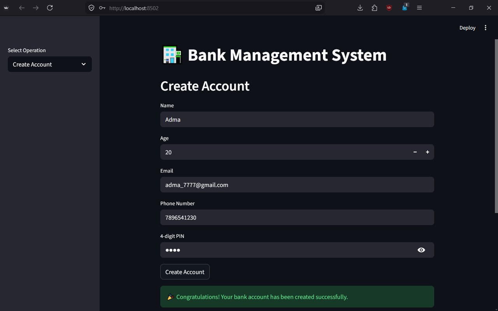
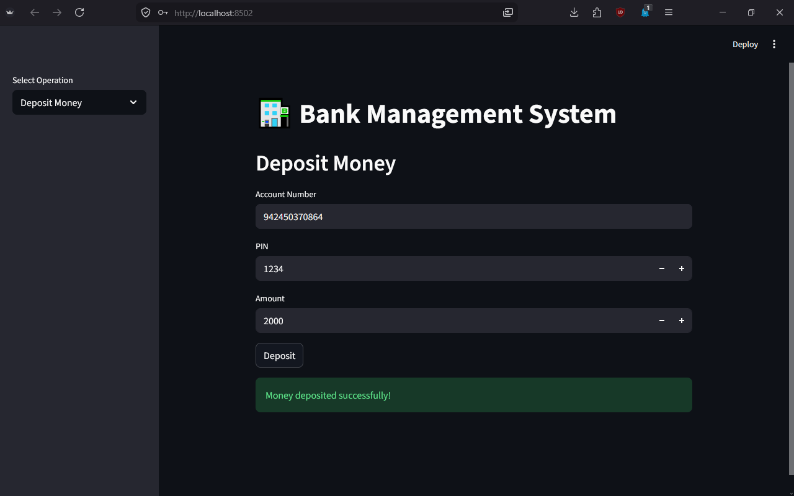
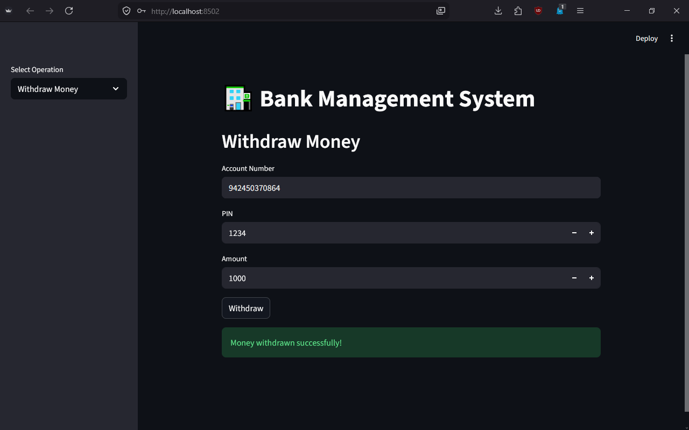

# 🏦 Python Bank Management System

A **Bank Management System** built using **Python**, **Object-Oriented Programming (OOP)**, **JSON**, and **Streamlit**. This project provides a simple banking application that allows users to create accounts, perform transactions, manage account details, and securely store data using a JSON database.

---

## ✨ Features

* 🆕 Create a new bank account
* 💰 Deposit money
* 💸 Withdraw money
* 📄 View account details
* ✏️ Update account information
* 🗑️ Delete an account
* 🔒 4-digit PIN authentication
* 💾 Persistent data storage using JSON
* 🖥️ Interactive Streamlit web interface
* 💻 Terminal-based version included

---

## 🛠️ Tech Stack

* Python
* Object-Oriented Programming (OOP)
* Streamlit
* JSON
* Git & GitHub

---

## 📂 Project Structure

```text
Python-Bank-Management-System/
│
├── app.py              # Streamlit application
├── main.py             # Terminal version
├── data.json           # JSON database
├── requirements.txt
├── README.md
├── .gitignore
├── LICENSE
└── screenshots/
```

---

## 🚀 Installation

1. Clone the repository.

```bash
git clone https://github.com/PulkitKagra/Bank-Management-System-Python-OOP.git
```

2. Navigate to the project folder.

```bash
cd Bank-Management-System-Python-OOP
```

3. Install the required package.

```bash
pip install -r requirements.txt
```

4. Run the Streamlit application.

```bash
streamlit run app.py
```

---

## 📸 Screenshots

### Create Account


.png).

### Deposite Money



### Withdraw Money 



### Account Details


### Update Details


### Delete Account 


---

## 🔮 Future Improvements

* Password hashing for improved security
* Transaction history
* Money transfer between accounts
* SQLite/MySQL database integration
* User login system
* Admin dashboard
* Account search functionality

---

## 👨‍💻 Author

**Pulkit Dev Kagra**

B.Tech ECE (AI & ML)

Aspiring Data Scientist | Machine Learning Enthusiast

If you found this project helpful, consider giving it a ⭐ on GitHub.
